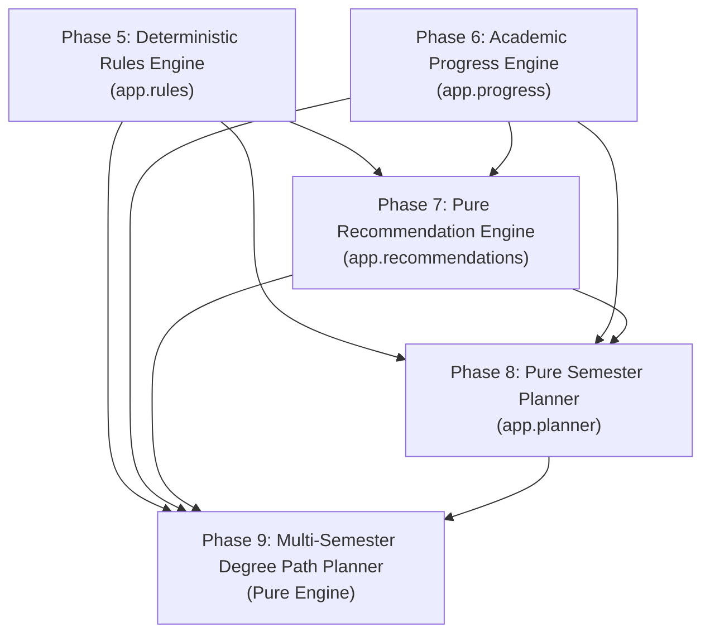
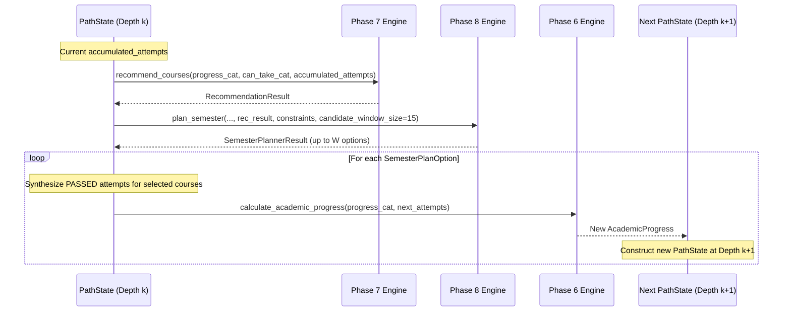
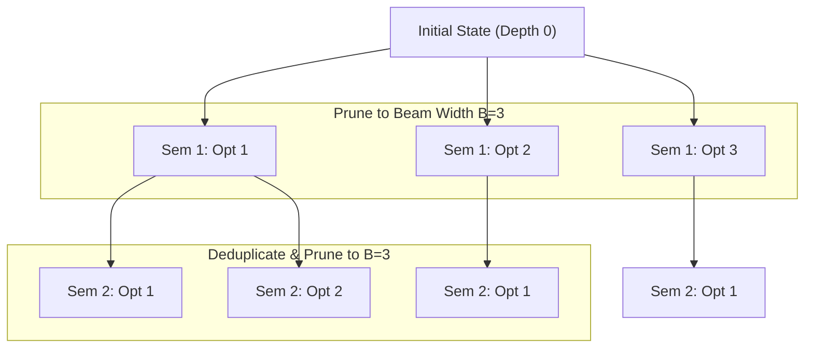
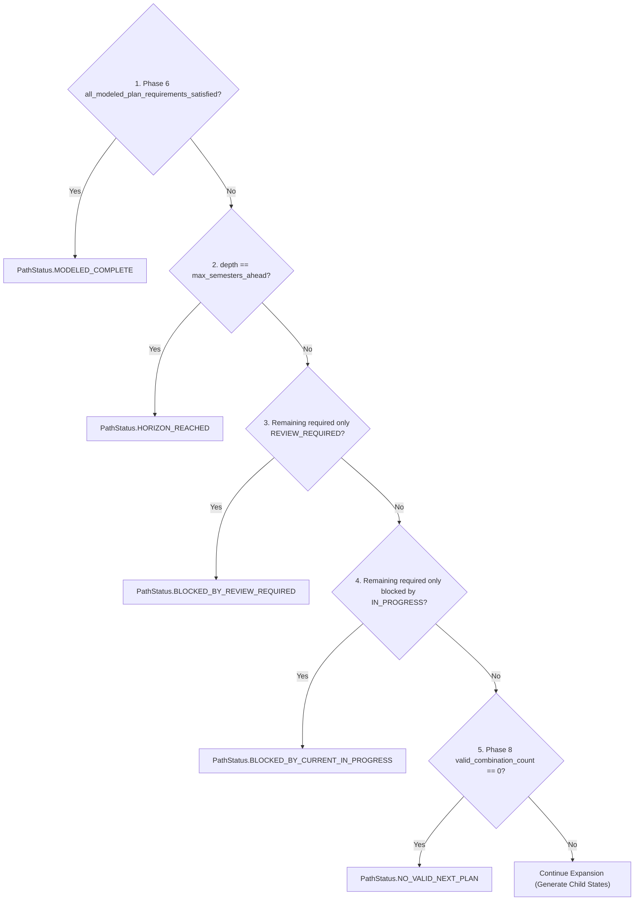

# Morshidi Degree Path Planning Policy & Search Specification

## Document Status

- **Phase:** 9.1 — Degree Path Planning Policy & Search Specification (Final Policy Cleanup)
- **Status:** SPECIFICATION ONLY — zero implementation
- **Policy Version:** `1.0`
- **Planning Scope:** `MODELED_DEGREE_PATH_ONLY`
- **Date:** 2026-09-17

---

## 1. Purpose & Product Philosophy

This specification defines the deterministic policy by which Morshidi generates and ranks **MULTI-SEMESTER DEGREE PATHS** (modeled sequences of future registration sets) for an authenticated student.

In the Morshidi academic architecture:
- **Phase 5 (CAN TAKE):** Answers whether prerequisite rules are satisfied for individual courses via `evaluate_can_take()`.
- **Phase 6 (ACADEMIC PROGRESS):** Quantifies student degree state, completed requirements, in-progress credits, and remaining credits via `calculate_academic_progress()`.
- **Phase 7 (SHOULD TAKE):** Ranks individual eligible courses by degree-progress utility via `recommend_courses()`.
- **Phase 8 (SEMESTER PLANNER):** Answers: *"Which combination of eligible courses should the student consider taking together in their next registration period?"* via `plan_semester()`.
- **Phase 9 (DEGREE PATH PLANNER):** Answers: **"What modeled sequence of future registration sets could advance the student through their remaining study plan toward completion?"**

The core product philosophy remains immutable:

$$\text{\textbf{AI explains — Rules decide.}}$$

The multi-semester planner builds strictly and deterministically on top of Phase 5, Phase 6, Phase 7, and Phase 8 outputs. It:
- **Never** relaxes prerequisite requirements.
- **Never** fabricates institutional scheduling authority, course offerings, or registration permissions.
- **Never** predicts actual graduation dates, calendar years, or academic standing.
- **Never** makes stochastic, heuristic, genetic, or AI-generated path selections.
- **Never** assumes currently in-progress courses will pass.
- **Never** claims official university degree clearance.

All generated paths represent **modeled academic study plan trajectories** under deterministic, exploratory simulation assumptions.

---

## 2. Scope

In scope for Phase 9:

1. **Deterministic Multi-Semester Sequencing:** Generating ordered sequences of future registration combinations (semesters) that advance student progress toward study plan completion.
2. **Hypothetical-Pass Simulation Semantics:** Formalizing the simulation assumption that courses selected in a modeled semester are hypothetically assumed to pass at the conclusion of that semester only.
3. **Current In-Progress Policy:** Explicit, conservative handling of real, persisted `IN_PROGRESS` course attempts as an exploratory modeling limitation.
4. **Planning Constraints Model (`DegreePathConstraints`):** Defining user planning preferences (`max_credit_hours_per_semester`, `max_courses_per_semester`, `max_semesters_ahead`, `max_paths`).
5. **Structural Search Bounds:** Structurally bounded Beam Search configured by engine parameters (`beam_width = 3`, `semester_branch_width = 3`, candidate window $M = 15$, `max_semesters_ahead <= 16`).
6. **Pure Domain Reuse:** Reusing Phase 5 (`evaluate_can_take`), Phase 6 (`calculate_academic_progress`), Phase 7 (`recommend_courses`), and Phase 8 (`plan_semester`) without duplicating logic or mutating state.
7. **Deterministic Search Algorithm:** Bounded Beam Search with depth-aware canonical state deduplication.
8. **State Representation & Transition:** Immutable state models tracking cumulative hypothetical attempts and derived progress.
9. **Path Status & Termination Rules:** Clear separation of path expansion termination from academic blocker diagnostics.
10. **Lexicographic Path Ranking:** Mathematical priority tuples for both intermediate partial paths and final degree paths.
11. **Blocker & Diagnostic Taxonomy:** Structured reasons identifying unresolved academic conditions in final states.
12. **Machine-Readable Reason Codes:** Transparent, auditable codes explaining why each path was constructed.
13. **Zero-Credit & Elective Policy:** Strict compliance with study plan group caps and non-credit requirements.
14. **Contract Specification:** Pure domain models, API schemas, and test matrices.

---

## 3. Non-Goals & Core Safety Principles

The degree path planner is an exploratory academic planning tool, not an administrative or predictive engine.

### Non-Goals

1. **No Graduation Date Prediction:** The planner does NOT output calendar dates, years, terms (e.g., "Fall 2027"), or completion timelines. Semesters are indexed abstractly: $\text{Semester } 1, 2, \dots, N$.
2. **No Course Offering Guarantees:** The engine assumes courses in the study plan can be modeled; it does NOT know or predict whether Zarqa University will offer specific sections in specific future terms.
3. **No Passing Guarantees:** Hypothetical passing in simulation is an exploratory modeling mechanism, NEVER a prediction of student academic performance or grades.
4. **No Institutional Registration Approval:** Paths carry zero administrative authority and cannot override advisor holds or university limits.
5. **No Timetable Scheduling:** The engine deals with academic course sets, not weekly class schedules or time conflicts.
6. **No AI Generation:** Large Language Models (LLMs) may be used in later presentation layers to summarize or explain paths, but the mathematical discovery, filtering, and ranking of paths is 100% deterministic rules code.

### Core Safety Principles

- **Structured Scope Marker:** Every Phase 9 result must emit:
  $$\texttt{planning\_scope} = \text{"MODELED\_DEGREE\_PATH\_ONLY"}$$
- **Disclaimers & Limitations:** Every output must carry explicit methodology notes declaring that the path is an exploratory academic simulation.

---

## 4. Relationship to Phases 5–8 (Architecture & Reuse Symbols)

The Morshidi architecture is strictly layered and unidirectional:



### Exact Reused Symbols:

1. **From Phase 5 (`app.rules`):**
   - Function: `evaluate_can_take`
   - Models: `CanTakeCatalog`, `CanTakeRequest`, `CanTakeDecision`, `Decision`, `DecisionReason`, `AttemptOutcome`, `StudentCourseAttempt`
2. **From Phase 6 (`app.progress`):**
   - Function: `calculate_academic_progress`
   - Models: `AcademicProgressCatalog`, `AcademicProgress`, `RequirementGroupProgress`, `CourseProgress`, `CourseProgressState`, `RequirementType`
3. **From Phase 7 (`app.recommendations`):**
   - Function: `recommend_courses`
   - Models: `RecommendationResult`, `RecommendationCandidate`, `ReviewRequiredCourse`, `RecommendationReason`
4. **From Phase 8 (`app.planner`):**
   - Function: `plan_semester`
   - Models & Constants: `PlannerConstraints`, `SemesterPlannerResult`, `SemesterPlanOption`, `PlannedCourseEntry`, `PlanReasonCode`, `DEFAULT_CANDIDATE_WINDOW_SIZE`

Phase 9 defines zero custom prerequisite traversal, zero custom credit counters, and zero custom semester-combination logic.

---

## 5. Planning Horizon & Finite Search Boundary

To prevent infinite recursion and unbounded search, Phase 9 enforces an explicit planning horizon:

1. **User Planning Horizon (`max_semesters_ahead`):**
   - Represents the maximum number of future registration sets the user wishes to explore.
   - Type: `int`.
   - Valid Range: $1 \le \text{max\_semesters\_ahead} \le 16$.
   - Default: $8$ semesters. Labeled purely as a **product convenience default**. It carries **zero implication of expected program duration, graduation timing, or calendar years**.
   - Ceiling ($16$): Labeled strictly as a **computational / API safety bound** to prevent excessive expansions when modeling low-credit preferences (e.g., 9 credits/semester).
2. **Validation Rule:**
   - Values $< 1$ or $> 16$ or non-integers raise `PlannerConstraintError`.
   - If a student is already complete at depth 0, the engine immediately returns a zero-semester completed path without simulation (see §20).

---

## 6. Hypothetical-Pass Assumption (Simulation Semantics)

To simulate degree progression into future semesters, the engine applies the **Hypothetical-Pass Assumption**:

> **Definition:** When a course combination $C_k = \{c_1, c_2, \dots, c_m\}$ is selected for modeled semester $k$, all courses in $C_k$ are assumed to transition to `AttemptOutcome.PASSED` at the exact conclusion of semester $k$.

### Invariants:
1. **Simulation Scope Only:** This assumption exists solely within in-memory `PathState` instances. No database records are created or modified.
2. **End-of-Semester Timing:** Selected courses do NOT pass during semester $k$; they pass at the end of semester $k$. Therefore, same-semester prerequisite chaining remains strictly impossible (enforced by Phase 8).
3. **Downstream Unlocking:** In modeled semester $k+1$, all courses dependent on $C_k$ become eligible (assuming all other prerequisite criteria are met).
4. **No Grade Fabrication:** No letter grade or numerical mark is synthesized. Attempt outcome is strictly `AttemptOutcome.PASSED`.

---

## 7. Current IN_PROGRESS Policy & Semantics

A critical boundary condition occurs when a student has real, persisted `IN_PROGRESS` course attempts at the start of planning.

### Final Decision: Conservative Non-Resolution

- **Policy:** Real, persisted `IN_PROGRESS` attempts are **NOT** automatically assumed to pass during degree path planning.
- **Behavior:**
  1. Persisted `IN_PROGRESS` courses remain in `CourseProgressState.IN_PROGRESS` throughout all simulated semesters.
  2. Because their outcome is unresolved, they cannot be registered again (excluded by Phase 6/7/8).
  3. Crucially, they **cannot satisfy prerequisites** for downstream courses in modeled semesters.
  4. If a remaining study plan requirement depends on a currently `IN_PROGRESS` course, downstream courses remain `NOT_ELIGIBLE` across all modeled future semesters until the student or university records an actual final grade (`PASSED`).
- **Path Consequence:** If degree completion requires courses locked behind a current `IN_PROGRESS` prerequisite, the path will advance as far as possible with independent courses, then terminate with status `BLOCKED_BY_CURRENT_IN_PROGRESS` (when `depth < max_semesters_ahead`).
- **Nature of Limitation:** This is an **exploratory modeling limitation** arising from our refusal to fabricate passing outcomes, NOT an academic dead-end or a prediction of student failure.

---

## 8. DegreePathConstraints Domain Model

User planning preferences are encapsulated in an immutable domain model:

```python
@dataclass(frozen=True)
class DegreePathConstraints:
    """Immutable user planning preferences and presentation constraints."""

    max_credit_hours_per_semester: Decimal
    max_courses_per_semester: int | None = None
    max_semesters_ahead: int = 8
    max_paths: int = 3
```

### Validation Rules:
1. `max_credit_hours_per_semester`:
   - Must be `Decimal`, `str`, or `int` (floats rejected).
   - $0.00 \le \text{value} \le 30.00$.
   - Safety ceiling matches Phase 8: `MAX_CREDIT_HOURS_SAFETY_CEILING = Decimal("30.00")`.
2. `max_courses_per_semester`:
   - If provided, must be integer in range $1 \le \text{value} \le 10$.
   - Optional (`None` allows credit limit alone to govern).
3. `max_semesters_ahead`:
   - Integer in range $1 \le \text{value} \le 16$. Default $8$.
4. `max_paths`:
   - Presentation limit governing returned paths.
   - Integer in range $1 \le \text{value} \le 10$. Default $3$.

---

## 9. Search Engine Structural Bounds Configuration

The search engine is governed by immutable structural bounds that make artificial node caps unnecessary:

```python
# Engine Structural Search Bounds
DEFAULT_BEAM_WIDTH = 3
DEFAULT_SEMESTER_BRANCH_WIDTH = 3
DEFAULT_CANDIDATE_WINDOW_SIZE = 15
```

- **`beam_width` ($B = 3$):** At each semester depth, the engine retains at most the top 3 partial paths based on the intermediate partial-path priority tuple. Beam pruning is standard search behavior; it is not a truncation error.
- **`semester_branch_width` ($W = 3$):** From each state, Phase 8 `plan_semester` is requested to produce up to 3 options (`max_options = 3`).
- **`candidate_window_size` ($M = 15$):** Inherited directly from Phase 8 to bound combinatorial subset generation per semester.
- **`MAX_EXPANDED_STATES` Decision:** Removed entirely for MVP. Under $B=3$ and $H \le 16$, the maximum parent expansions across the entire search cannot exceed $B \times H = 48$. A cap such as 250 is mathematically unreachable and redundant.

---

## 10. Exact Degree Completion Definition (Phase 6 Derivation)

Phase 9 does NOT implement independent graduation math or credit tallying. Degree completion is evaluated **strictly and exclusively** through Phase 6 `AcademicProgress`.

### Authoritative Phase 6 Fields Used:
The Phase 6 `AcademicProgress` model contains the following verified fields:
- `plan_total_required_credits: Decimal`
- `completed_plan_credits: Decimal`
- `in_progress_plan_credits: Decimal`
- `remaining_plan_credits: Decimal`
- `satisfied_requirement_group_count: int`
- `total_requirement_group_count: int`
- `all_modeled_plan_requirements_satisfied: bool`
- `requirement_groups: tuple[RequirementGroupProgress, ...]`
- `courses: tuple[CourseProgress, ...]`

### Exact Mechanical Completion Predicate:
A modeled path reaches `MODELED_COMPLETE` if and only if, evaluated upon the state's `AcademicProgress`:

$$\text{progress.all\_modeled\_plan\_requirements\_satisfied is True}$$

Under Phase 6 engine mechanics (`app/progress/engine.py` lines 97–101, 128–143), `all_modeled_plan_requirements_satisfied == True` mathematically guarantees:
1. `progress.remaining_plan_credits == Decimal("0")`.
2. `all(rg.is_satisfied for rg in progress.requirement_groups)` is `True`.
3. In all compulsory requirement groups (`UNIVERSITY_REQUIRED`, `FACULTY_REQUIRED`, `MAJOR_REQUIRED`), every listed course has `state is CourseProgressState.COMPLETED`.
4. Therefore, zero-credit required courses (`0200115` in `UNIVERSITY_REQUIRED`, `1509999` in `FACULTY_REQUIRED`) are guaranteed to have `CourseProgressState.COMPLETED`.

Phase 9 executes zero custom group loops or credit sums to verify completion.

---

## 11. Path Status & Blocker Diagnostics Taxonomy

To maintain architectural clarity, Phase 9 strictly separates:
- **`PathStatus`:** Answers *"Why did deterministic path expansion stop?"*
- **Blocker Diagnostics:** Answers *"What unresolved conditions remain in this final academic state?"*

### 1. Academic Path Status (`PathStatus`)
Applies to individual generated `DegreePathOption` instances:

```python
class PathStatus(str, Enum):
    MODELED_COMPLETE = "MODELED_COMPLETE"
    """All modeled study plan requirements are satisfied under simulation."""

    HORIZON_REACHED = "HORIZON_REACHED"
    """The path reached max_semesters_ahead without fully satisfying all requirements."""

    BLOCKED_BY_REVIEW_REQUIRED = "BLOCKED_BY_REVIEW_REQUIRED"
    """When depth < max_semesters_ahead: remaining modeled requirements include prerequisite logic requiring review."""

    BLOCKED_BY_CURRENT_IN_PROGRESS = "BLOCKED_BY_CURRENT_IN_PROGRESS"
    """When depth < max_semesters_ahead: remaining courses cannot be planned because they depend on an active in-progress course."""

    NO_VALID_NEXT_PLAN = "NO_VALID_NEXT_PLAN"
    """When depth < max_semesters_ahead: no valid semester plan combination could be formed under constraints."""
```

### 2. Blocker Diagnostics
Recorded in `DegreePathOption.unresolved_blocker_codes` and diagnostic metadata, regardless of whether the path terminated due to `HORIZON_REACHED` or a specific blocking condition:
- A path with status `HORIZON_REACHED` may still report `REVIEW_REQUIRED_BLOCKER` or `CURRENT_IN_PROGRESS_BLOCKER` in its diagnostics. Those diagnostics explain what is pending in that state, but do not replace `HORIZON_REACHED` as the path status.

---

## 12. State Representation

Search state is modeled as an immutable dataclass representing the student's accumulated academic condition at a given depth:

```python
@dataclass(frozen=True)
class PathState:
    """Immutable academic simulation state at a specific path depth."""

    depth: int  # Current semester depth (0 = initial state before future planning)
    accumulated_attempts: tuple[StudentCourseAttempt, ...]
    academic_progress: AcademicProgress
    selected_plan_options: tuple[SemesterPlanOption, ...]
    unresolved_blocker_codes: tuple[str, ...]
    search_path_codes: tuple[tuple[str, ...], ...]  # Tuple of course code tuples per semester
```

- **`depth`:** Integer count of simulated semesters elapsed in this path ($0, 1, 2, \dots$).
- **`accumulated_attempts`:** Original persisted attempts plus all synthetic `PASSED` attempts from previous modeled semesters.
- **`academic_progress`:** Output of Phase 6 `calculate_academic_progress` for `accumulated_attempts`.
- **`selected_plan_options`:** Sequence of Phase 8 `SemesterPlanOption` selections.

---

## 13. State Transition Model

State evolution follows an immutable step-by-step pipeline:



### Transition Steps:
1. Given `PathState_k` with `accumulated_attempts_k`.
2. First evaluate termination rules (§19). If path terminates, finalize `DegreePathOption`.
3. If expanding, invoke `recommend_courses(progress_catalog, eligibility_catalog, accumulated_attempts_k)`.
4. Invoke `plan_semester(progress_catalog, eligibility_catalog, accumulated_attempts_k, rec_result, planner_constraints, candidate_window_size=15)`.
5. For each generated `SemesterPlanOption` (up to `semester_branch_width = 3`):
   - Synthesize new attempts:
     $$\text{new\_attempts} = \text{accumulated\_attempts\_k} + \left(\text{StudentCourseAttempt}(c, \text{outcome}=\text{PASSED}) \;\forall\; c \in \text{option.courses}\right)$$
   - Calculate updated progress:
     $$\text{progress}_{k+1} = \text{calculate\_academic\_progress}(\text{progress\_catalog}, \text{new\_attempts})$$
   - Form `PathState_{k+1}` with `depth = k + 1`.

---

## 14. Phase 5 Reuse (Prerequisite Validation)

Phase 9 makes **zero direct calls** to prerequisite logic. Prerequisite checking is delegated entirely to:
- **Phase 7 (`recommend_courses`):** Which calls Phase 5 `evaluate_can_take()` to determine candidate eligibility.
- **Phase 8 (`plan_semester`):** Which calls Phase 5 `evaluate_can_take()` to assess downstream course unlocking impact.

No custom prerequisite traversal or dependency graph walking is permitted in Phase 9.

---

## 15. Phase 6 Reuse (Academic Progress Evaluation)

At each state transition, Phase 9 recomputes degree progress using Phase 6 `calculate_academic_progress()`:
- Provides accurate credit accounting across requirement groups.
- Applies elective caps deterministically (excess elective credits do not credit toward degree total).
- Identifies newly satisfied groups.
- Verifies degree completion milestones.

No custom credit counters or group satisfaction checks exist in Phase 9.

---

## 16. Phase 7 Reuse (Course Recommendation Ranking)

At every intermediate state, Phase 7 `recommend_courses()` is executed anew against the state's `accumulated_attempts`.
- Phase 7 rankings dynamically reflect courses unlocked by preceding hypothetical semesters.
- Stale recommendation candidates are never carried forward.
- Review-required courses are surfaced accurately at each state.

---

## 17. Phase 8 Reuse (Semester Plan Combination Generation)

Phase 8 `plan_semester()` is the authoritative engine for generating single-semester course combinations:
- Enforces user credit and course count constraints for each individual semester.
- Guarantees zero same-semester prerequisite chaining.
- Provides ranked `SemesterPlanOption` instances with set-level utility and reason codes.

Phase 9 consumes `SemesterPlanOption` instances as atomic building blocks.

---

## 18. Search Strategy: Deterministic Beam Search

To explore the multi-semester planning tree without exponential explosion, Phase 9 utilizes **Deterministic Beam Search with Depth-Aware Canonical State Deduplication**.



### Search Invariants:
1. **Breadth-Level Expansion:** All active beam states at depth $k$ are expanded by generating up to $W=3$ Phase 8 options.
2. **State Deduplication:** Child states reaching identical canonical progress points are deduplicated using the Depth-Aware Collision Policy (§21).
3. **Partial-Path Ranking:** All unique child states at depth $k+1$ are ranked using the deterministic Partial-Path Priority Tuple (§25).
4. **Beam Pruning:** The top $B=3$ partial paths are retained for expansion at depth $k+2$. The remainder are pruned.
5. **Terminal State Collection:** States that reach completion or cannot expand further are moved to a terminal candidate pool.

---

## 19. Complexity Analysis & Computational Bounds

### Distinct Computational Tiers

Phase 9's computational complexity consists of two distinct tiers:

#### Tier A: Multi-Semester Beam Search State Expansion
- Beam width: $B = 3$.
- Semester branch width: $W = 3$.
- Planning horizon: $H \le 16$.
- Maximum parent state expansions across the entire search:
  $$\text{ParentExpansions} \le B \times H \le 3 \times 16 = 48 \text{ expansions}$$
- Maximum child states evaluated across the search:
  $$\text{ChildEvaluations} \le B \times H \times W \le 48 \times 3 = 144 \text{ evaluations}$$

#### Tier B: Intra-Semester Combinatorial Search (Inside Phase 8)
- Every expanded parent state invokes Phase 8 `plan_semester(...)`.
- In each invocation, Phase 8 explores combinations over candidate window $M = 15$.
- Theoretical unpruned subset search space per Phase 8 invocation:
  $$2^{15} - 1 = 32,767 \text{ candidate subsets}$$
- Phase 8 prunes branches via depth-first branch-and-bound against `max_credit_hours` and `max_courses`, and for each valid combination computes Phase 6 progress deltas and Phase 5 unlock evaluations.

### Total Work & Runtime Confirmation
$$\text{Total Work} = \mathcal{O}\left((B \times H) \times \text{Work}_{\text{Phase 8}}(M=15)\right)$$
Total computational work is the product of beam expansions and intra-semester Phase 8 combinatorial evaluation. **All unsupported runtime guarantees are strictly removed**. Empirical execution time will be measured during Phase 9.2 implementation benchmarking.

---

## 20. State Deduplication & Depth-Aware Collision Policy

Different semester permutations can reach identical academic progress states. For example:
- Path 1: Semester 1 takes $\{A, B\}$, Semester 2 takes $\{C, D\}$.
- Path 2: Semester 1 takes $\{A, C\}$, Semester 2 takes $\{B, D\}$.
Both arrive at the identical completed course set $\{A, B, C, D\}$.

Furthermore, different paths may reach the same completed course set at **different semester depths** (e.g., Path A at depth 3; Path B at depth 5).

### Academic State Key
$$\text{AcademicStateKey} = \left(\text{frozenset}(C_{\text{completed\_and\_hypothetical}}),\; \text{frozenset}(C_{\text{persisted\_in\_progress}})\right)$$

### Exact Collision Policy
When two paths yield the identical `AcademicStateKey`:
1. **Prefer Smaller Semester Depth:** The path with the lower `depth` strictly wins.
   - *Rationale:* Reaching state $X$ in fewer semesters leaves more remaining planning horizon ($H - \text{depth}$) and represents faster academic progression.
2. **Equal Depth Tiebreaker:** If both paths reach state $X$ at the identical `depth`, the path with the superior intermediate **Partial-Path Priority Tuple** (§25) wins.
3. **Single Representative Retained:** Only the winning path remains in the beam; the duplicate path is discarded immediately.

### Proof of Safety under Monotonicity
- Every Phase 8 semester option consists exclusively of incomplete, eligible courses.
- Upon hypothetical passing, $|C_{\text{completed\_and\_hypothetical}}|$ strictly increases.
- Because completed courses are permanently excluded from future recommendations, course repetition is impossible.
- State progression is strictly monotonic and directed acyclic (DAG). Discarding a deeper duplicate path is strictly optimal because it can never reach any academic state that the shallower path cannot also reach with more remaining horizon.
- Historical attempts (`FAILED`, `WITHDRAWN`, `IN_PROGRESS`) are fixed at depth 0 and preserved identically across all branches, ensuring Phase 7 contextual fields (`previously_attempted`) remain accurate.

---

## 21. Beam Search Global Optimality Limitation

> **Explicit Limitation:**
> Because `beam_width = 3` prunes branches at each semester depth, Phase 9 is **NOT globally optimal**. It is not even guaranteed optimal across every path that could be formed from Phase 8's top-$M$ candidate windows ($M=15$).
> The engine produces a **deterministic bounded search result** within the defined beam search procedure. Phrases such as "bounded optimality" are strictly avoided.

---

## 22. Path Ranking Philosophy & Principles

Path ranking governs which degree paths are presented to the student and in what order:

1. **Modeled Completion Strictly Dominates:** A path that achieves full modeled degree completion (`MODELED_COMPLETE`) strictly outranks any incomplete path, regardless of credit deltas or semester counts.
2. **Fewer Modeled Semesters Preferred Among Complete Paths:** If two paths achieve modeled completion, the path requiring fewer simulated registration sets is ranked higher.
   - *Forbidden Wording:* This represents fewer modeled registration cycles under hypothetical assumptions; it must **never** be labeled as "faster graduation".
3. **Maximal Progress Preferred Among Incomplete Paths:** If paths terminate without full completion, the path that completed more degree credits and requirement groups is ranked higher.
4. **Fewer Blockers Preferred:** Paths with fewer unresolvable prerequisite blockers rank higher.
5. **Phase 8 Coherence Tiebreaker:** Aggregate sum of Phase 8 option ranks breaks ties.
6. **Strict Lexicographic Determinism:** Zero arbitrary scoring weights. Zero randomness.

---

## 23. Exact Final Path Ranking Priority Tuple

Final paths are sorted in ascending order of their mathematical priority tuple:

$$\text{FinalPriorityTuple} = \left(-P_1, P_2, -P_3, -P_4, P_5, P_6, P_7\right)$$

| Symbol | Component | Type | Sort Direction | Description |
|---|---|---|---|---|
| $P_1$ | `completion_rank` | `int` | Descending ($-P_1$) | `1` if `MODELED_COMPLETE`, `0` otherwise. Complete paths strictly dominate. |
| $P_2$ | `semester_count` | `int` | Ascending ($+P_2$) | Fewer modeled semesters rank higher (for complete paths). |
| $P_3$ | `completed_credits_delta` | `Decimal` | Descending ($-P_3$) | Net degree credits earned across the modeled path. |
| $P_4$ | `newly_satisfied_groups` | `int` | Descending ($-P_4$) | Total requirement groups transitioned to satisfied. |
| $P_5$ | `unresolved_blocker_count`| `int` | Ascending ($+P_5$) | Fewer blocking courses rank higher. |
| $P_6$ | `aggregate_rank_sum` | `int` | Ascending ($+P_6$) | Sum of Phase 8 option ranks across semesters (lower is better). |
| $P_7$ | `canonical_path_codes` | `tuple[str, ...]`| Ascending ($+P_7$) | Alphabetical tuple of course codes across semesters (tiebreaker). |

---

## 24. Exact Partial-Path Ranking Priority Tuple

During intermediate beam search (at depth $k$), partial paths are ranked for beam retention using:

$$\text{PartialPriorityTuple} = \left(-Q_1, Q_2, -Q_3, -Q_4, Q_5, Q_6, Q_7\right)$$

| Symbol | Component | Type | Sort Direction | Description |
|---|---|---|---|---|
| $Q_1$ | `is_complete` | `int` | Descending ($-Q_1$) | `1` if path reached `MODELED_COMPLETE` early; `0` otherwise. |
| $Q_2$ | `depth` | `int` | Ascending ($+Q_2$) | Shallower depth ranks higher (more remaining horizon). |
| $Q_3$ | `modeled_credits_delta` | `Decimal` | Descending ($-Q_3$) | Cumulative degree credits completed up to depth $k$. |
| $Q_4$ | `satisfied_groups_count` | `int` | Descending ($-Q_4$) | Requirement groups satisfied up to depth $k$. |
| $Q_5$ | `blocker_count` | `int` | Ascending ($+Q_5$) | Count of review-required or in-progress blockers. |
| $Q_6$ | `aggregate_rank_sum` | `int` | Ascending ($+Q_6$) | Sum of Phase 8 ranks up to depth $k$. |
| $Q_7$ | `canonical_path_codes` | `tuple[str, ...]`| Ascending ($+Q_7$) | Deterministic tiebreaker on course codes. |

---

## 25. Tie-Breaking Mechanics & Determinism

- If two paths match on all numerical and academic criteria ($P_1$ through $P_6$), the engine evaluates $P_7$: the canonical sequence of all course codes across all semesters:
  $$\text{canonical\_path\_codes} = (c_{1,1}, c_{1,2}, \dots, c_{1,m_1}, c_{2,1}, \dots, c_{k,m_k})$$
- Because course codes within each semester are sorted by `display_order` and `course_code`, $P_7$ is guaranteed unique for distinct paths.
- Sorting is 100% deterministic and invariant across execution platforms.

---

## 26. Path Reason Codes

Paths emit stable, machine-readable reason codes explaining their composition and outcome:

```python
class PathReasonCode(str, Enum):
    REACHES_MODELED_PLAN_COMPLETION = "REACHES_MODELED_PLAN_COMPLETION"
    """Path successfully satisfies all modeled study plan requirements under simulation."""

    FEWER_MODELED_SEMESTERS = "FEWER_MODELED_SEMESTERS"
    """Path achieves completion in fewer modeled semesters than competing valid paths."""

    MAXIMIZES_PROGRESS_WITHIN_HORIZON = "MAXIMIZES_PROGRESS_WITHIN_HORIZON"
    """Path achieves the maximal credit and requirement progress within the planning horizon."""

    CONTAINS_MANDATORY_COURSES = "CONTAINS_MANDATORY_COURSES"
    """Path incorporates mandatory study plan courses in its planned semesters."""

    INCLUDES_ZERO_CREDIT_REQUIRED = "INCLUDES_ZERO_CREDIT_REQUIRED"
    """Path schedules required zero-credit courses (e.g. 0200115, 1509999)."""

    COMPLETES_ALL_REQUIREMENT_GROUPS = "COMPLETES_ALL_REQUIREMENT_GROUPS"
    """Path satisfies 100% of the study plan requirement groups."""

    INCLUDES_PREVIOUSLY_ATTEMPTED_COURSE = "INCLUDES_PREVIOUSLY_ATTEMPTED_COURSE"
    """Path includes at least one course previously attempted but not passed."""

    BLOCKED_BY_REVIEW_REQUIRED = "BLOCKED_BY_REVIEW_REQUIRED"
    """Further path progression halted due to courses requiring academic review."""

    BLOCKED_BY_CURRENT_IN_PROGRESS = "BLOCKED_BY_CURRENT_IN_PROGRESS"
    """Path progression halted because remaining courses depend on an active in-progress attempt."""

    NO_VALID_NEXT_SEMESTER = "NO_VALID_NEXT_SEMESTER"
    """Path halted because no valid course combination could be formed under constraints."""
```

---

## 27. Semester Entry Model

Each semester within a degree path is represented by a structured model:

```python
@dataclass(frozen=True)
class ModeledSemesterEntry:
    """A single modeled semester within a multi-semester degree path."""

    semester_index: int  # 1-based index (1, 2, 3, ...)
    plan_option: SemesterPlanOption  # Full Phase 8 SemesterPlanOption
    completed_plan_credits_after: Decimal  # Progress snapshot immediately after this semester
    remaining_plan_credits_after: Decimal
    newly_satisfied_requirement_group_codes: tuple[str, ...]
```

---

## 28. DegreePathOption Model

A complete multi-semester path option returned to callers:

```python
@dataclass(frozen=True)
class DegreePathOption:
    """A complete ranked multi-semester degree path option."""

    rank: int  # 1-based rank (1 = best path)
    status: PathStatus
    semesters: tuple[ModeledSemesterEntry, ...]
    semester_count: int
    total_planned_courses: int
    total_planned_credits: Decimal
    final_completed_plan_credits: Decimal
    final_remaining_plan_credits: Decimal
    newly_satisfied_requirement_group_codes: tuple[str, ...]
    remaining_required_course_codes: tuple[str, ...]
    unresolved_blocker_codes: tuple[str, ...]
    aggregate_semester_rank_sum: int
    priority_tuple: tuple[int, int, Decimal, int, int, int, tuple[str, ...]]
    reason_codes: tuple[PathReasonCode, ...]
```

---

## 29. DegreePathResult Model

The top-level container returned by the pure degree path engine:

```python
@dataclass(frozen=True)
class DegreePathResult:
    """Complete deterministic result returned by the degree path planning engine."""

    study_plan_id: str
    degree_path_policy_version: str  # "1.0"
    planning_scope: str  # "MODELED_DEGREE_PATH_ONLY"
    constraints: DegreePathConstraints
    paths: tuple[DegreePathOption, ...]
    initial_completed_credits: Decimal
    initial_remaining_credits: Decimal
    initial_satisfied_group_count: int
    total_requirement_group_count: int
    unresolved_review_required_courses: tuple[str, ...]
    persisted_in_progress_courses: tuple[str, ...]
    total_parent_states_expanded: int
    methodology_note: str
    limitations: tuple[str, ...]
```

---

## 30. Policy Version

The engine publishes an independent, dedicated policy version:

$$\texttt{DEGREE\_PATH\_POLICY\_VERSION} = \text{"1.0"}$$

---

## 31. Planning Scope Marker

Every result emitted by Phase 9 contains the immutable scope marker:

$$\texttt{planning\_scope} = \text{"MODELED\_DEGREE\_PATH\_ONLY"}$$

---

## 32. Termination Rules & Exact Precedence

When a path state is evaluated at depth $k$, termination is governed by strict semantic precedence:



### Interpretation of Precedence:
1. **`MODELED_COMPLETE` (Priority 1):** If `progress.all_modeled_plan_requirements_satisfied` is `True`, the path terminates with complete status, even if `depth == max_semesters_ahead`.
2. **`HORIZON_REACHED` (Priority 2):** If the path is not complete and `depth == max_semesters_ahead`, expansion halts because the configured planning horizon was reached.
   - *Key Distinction:* Even if unresolved conditions (such as `REVIEW_REQUIRED` or `IN_PROGRESS`) exist in this state, the path stopped because the horizon was reached, NOT because a blocker prevented the next expansion. Blocker diagnostics are recorded in `unresolved_blocker_codes`, but the path status is `HORIZON_REACHED`.
3. **`BLOCKED_BY_REVIEW_REQUIRED` (Priority 3):** Evaluated ONLY when `depth < max_semesters_ahead`. Triggered when all remaining required courses carry prerequisite logic requiring review (`1505311` is `unresolved`; `1505320` is `source_conflict`).
4. **`BLOCKED_BY_CURRENT_IN_PROGRESS` (Priority 4):** Evaluated ONLY when `depth < max_semesters_ahead`. Triggered when remaining courses depend on an active in-progress attempt that cannot be assumed to pass.
5. **`NO_VALID_NEXT_PLAN` (Priority 5):** Evaluated ONLY when `depth < max_semesters_ahead`. Triggered when eligible courses exist but Phase 8 cannot form any combination satisfying constraints (e.g., credit limit too small), and no more specific blocking status applies.

---

## 33. Blocker Taxonomy & Diagnostics

When paths do not achieve `MODELED_COMPLETE`, unresolved conditions are categorized using deterministic diagnostics:

```python
class BlockerType(str, Enum):
    REVIEW_REQUIRED_BLOCKER = "REVIEW_REQUIRED_BLOCKER"
    """Course prerequisite rules are unresolved or contain conflicting sources (e.g. 1505311, 1505320)."""

    CURRENT_IN_PROGRESS_BLOCKER = "CURRENT_IN_PROGRESS_BLOCKER"
    """A remaining modeled requirement is currently active (IN_PROGRESS) and unresolved."""

    PREREQUISITES_LOCKED = "PREREQUISITES_LOCKED"
    """Phase 5 reports missing prerequisite groups for a relevant remaining requirement."""

    PLAN_CONSTRAINTS_TOO_RESTRICTIVE = "PLAN_CONSTRAINTS_TOO_RESTRICTIVE"
    """Requested credit hours or course limits prevent selecting remaining eligible courses."""

    CANDIDATE_WINDOW_EXCLUSION = "CANDIDATE_WINDOW_EXCLUSION"
    """Top-M produced no plan and an outside-window recommendation fits the active constraints."""
```

Diagnostics are evidence-based and optional. Empty recommendations or an empty
Phase 8 plan set do not by themselves prove a prerequisite lock. Likewise,
having more than $M$ recommendations does not by itself prove a candidate-window
blocker. If existing Phase 5–8 outputs cannot establish a specific cause, the
engine omits that diagnostic rather than guessing.

---

## 34. REVIEW_REQUIRED Handling Policy

In Plan 12, two courses carry prerequisite logic requiring review:
- **`1505311` (`تعلم الالة` / Machine Learning — 3 cr):** Prerequisite logic status `unresolved`.
- **`1505320` (`تعلم الآلة المتقدم` / Advanced Machine Learning — 3 cr):** Prerequisite logic status `source_conflict`.

### Policy:
1. **Never Bypassed:** The engine will NEVER hypothetically assume review-required courses are eligible or passed without authoritative resolution.
2. **Partial Progress Permitted:** The path may freely schedule and pass all other independent study plan courses.
3. **Completion Blocked:** If `1505311` or `1505320` remain required, the path CANNOT achieve `MODELED_COMPLETE`. It halts with `BLOCKED_BY_REVIEW_REQUIRED` (if `depth < max_semesters_ahead`) once all unblocked requirements are exhausted.
4. **Transparent Surfacing:** Review-required courses are listed in `DegreePathOption.unresolved_blocker_codes` and top-level result metadata.

---

## 35. Zero-Credit Course Handling

Plan 12 contains two required zero-credit courses with exact canonical names and groups:
- **`0200115` (`تنمية المجتمع والعمل التطوعي` / Community Development and Volunteer Work — 0 cr):** Group `UNIVERSITY_REQUIRED` (`متطلبات جامعة إجبارية`).
- **`1509999` (`حلقة بحث لطلبة كلية تكنولوجيا المعلومات` / Research Seminar for IT College Students — 0 cr):** Group `FACULTY_REQUIRED` (`متطلبات كلية إجبارية`).
*(Note: `0200110` `العلوم العسكرية` / Military Science is 3 credits in `UNIVERSITY_REQUIRED`).*

### Policy:
- Zero-credit courses consume $0.00$ credit hours from the semester credit budget.
- They count as $1$ course toward `max_courses_per_semester`.
- They are eligible whenever their prerequisite rules are met.
- **Completion Guard:** Because Phase 6 requires 100% course completion in `UNIVERSITY_REQUIRED` and `FACULTY_REQUIRED`, a path CANNOT achieve `all_modeled_plan_requirements_satisfied = True` until both `0200115` and `1509999` have state `CourseProgressState.COMPLETED`.

---

## 36. Elective Group Cap Handling

In Plan 12:
- **University Elective (`UNIVERSITY_ELECTIVE`):** 9 credits required out of 33 credits listed in catalog.
- **Major Elective (`MAJOR_ELECTIVE`):** 9 credits required out of 39 credits listed in catalog.

### Policy:
- Phase 6 enforces group caps strictly. Once 9 credits are passed (in history or simulation), `remaining_required_credits` becomes `0.00`.
- Phase 7 filters out candidates from satisfied elective groups (`active_candidate_codes` step).
- Phase 8 and 9 will therefore NEVER schedule excess elective courses beyond the required group cap.
- Total modeled plan credits will never artificially inflate past the 132-credit degree total.

---

## 37. Failed & Withdrawn Course Handling

- Courses with historical outcomes `FAILED` or `WITHDRAWN` remain in the student's immutable history.
- When evaluated by Phase 5 and Phase 7, previously failed courses are eligible for re-registration if prerequisite rules allow.
- If selected in a future modeled semester, the course is hypothetically assumed `PASSED` in that semester.
- Prior failure records are preserved; path reason code `INCLUDES_PREVIOUSLY_ATTEMPTED_COURSE` is emitted.

---

## 38. Current In-Progress Conservative Limitation

Because active `IN_PROGRESS` attempts are not assumed to pass:
- Students with in-progress prerequisite courses cannot see future paths that depend on those courses until grades are posted.
- *Example:* If a student is currently taking `1501110` (Programming 1), the engine will not schedule `1501112` (Programming 2) in Semester 1, 2, or beyond.
- This is an intentional exploratory modeling limitation, fully documented in `limitations`.

---

## 39. Future API Direction

Phase 9.3 will introduce the authenticated degree path endpoint:

$$\texttt{POST /api/v1/me/degree-paths}$$

### Request Schema:
```json
{
  "max_credit_hours_per_semester": 15,
  "max_courses_per_semester": 5,
  "max_semesters_ahead": 8,
  "max_paths": 3
}
```

### Security & Invariants:
- `user_id` and student ownership are derived strictly from the verified JWT bearer token.
- No student ID, study plan ID, or historical attempts are accepted in the request body.
- Purely read-only computation; zero persistence; zero synthetic data written to database.

---

## 40. Security Boundary & Authentication Invariants

1. **Authentication:** Endpoint strictly guarded by Supabase JWT validation.
2. **Tenant Isolation:** Student study plan and attempts are queried using authenticated `user_id` with Row Level Security (RLS) enforcement.
3. **No Credential Exposure:** Service role keys are never used in client paths.
4. **Transport Independence:** Domain models (`DegreePathResult`, `DegreePathOption`) contain zero HTTP, FastAPI, or database dependencies.

---

## 41. Determinism & Idempotence Proof

1. **Pure Functional Pipelines:** All sub-engines (Phase 5, 6, 7, 8) and Phase 9 search take immutable data structures and return immutable frozen dataclasses.
2. **Stable Sorting:** Every list of candidates, courses, groups, and options is sorted by unambiguous, deterministic composite keys.
3. **Proof of Idempotence:** Given identical catalog data, identical student attempts, and identical `DegreePathConstraints`:
   $$\text{plan\_degree\_paths}(D, A, C) \equiv \text{plan\_degree\_paths}(D, A, C)$$
   The generated path options, priority tuples, reason codes, and semester assignments will match bit-for-bit across any number of executions.

---

## 42. Auditability & Traceability

Every path returned provides complete internal explainability:
- Exact Phase 8 options chosen for each semester, including their individual credit totals, mandatory counts, and Phase 7 rank sums.
- Exact progress deltas per semester.
- Explicit priority tuples exposing the exact mathematical basis for ranking.
- Complete lists of remaining requirements and active blockers.

---

## 43. Complete Test Matrix

Phase 9.2 implementation will be validated against an exhaustive 56-test matrix:

### 1. Constraints & Input Validation (1–8)
1. Valid default constraints ($15.00$ credits, 8 semesters, 3 paths).
2. Credit hours as integer, string, and Decimal.
3. Reject float credit hours.
4. Reject negative credit hours.
5. Reject credit hours exceeding safety ceiling ($> 30.00$).
6. Reject non-integer or out-of-range `max_courses_per_semester` ($< 1$ or $> 10$).
7. Reject out-of-range `max_semesters_ahead` ($< 1$ or $> 16$).
8. Reject out-of-range `max_paths` ($< 1$ or $> 10$).

### 2. Initial State & Special Cases (9–14)
9. Already modeled-complete student: returns single zero-semester path with `MODELED_COMPLETE` via `all_modeled_plan_requirements_satisfied`.
10. Empty student history (brand new student): successfully generates multi-semester path starting from Year 1 courses.
11. Real `IN_PROGRESS` attempts preserved and excluded from passing.
12. Real `FAILED` attempts preserved and eligible for rescheduling.
13. Student with no eligible courses: returns valid result with `NO_VALID_NEXT_PLAN`.
14. Preserved attempts immutability (input attempt tuple is never mutated).

### 3. Multi-Semester Prerequisites & Unlocking (15–22)
15. Multi-semester chain $A \to B \to C$: $A$ in Sem 1, $B$ in Sem 2, $C$ in Sem 3.
16. Strict rejection of same-semester prerequisite chaining (inherited from Phase 8).
17. Joint AND prerequisite unlocking: Courses requiring both $X$ and $Y$ unlock only after both pass.
18. Concurrent unlocking: Completing prerequisite $P$ in Sem 1 unlocks multiple downstream courses in Sem 2.
19. Credit-completion prerequisite: Course requiring 60 completed credits unlocks only in the semester after 60 credits are accumulated.
20. `0300103` (`الإحصاء والاحتمالات`): Referenced-only prerequisite handling.
21. Real Plan 12 chain: `0300153` $\to$ `1501110` $\to$ `1501112` $\to$ `1501221`.
22. Unlocking respects display order and candidate window bounding.

### 4. Degree Completion Verification (23–28)
23. Modeled completion detected strictly through Phase 6 `all_modeled_plan_requirements_satisfied is True`.
24. Zero-credit required courses (`0200115` in `UNIVERSITY_REQUIRED`, `1509999` in `FACULTY_REQUIRED`) must pass before completion is declared.
25. Elective requirement caps respected: Path never exceeds 9 credits in University or Major Electives.
26. Total degree credits in complete path match exact study plan requirement (132 credits for Plan 12).
27. Referenced-only course (`0300103`) does not contribute toward degree credit total.
28. Modeled completion takes priority over `HORIZON_REACHED` when occurring on the final horizon semester (`depth == max_semesters_ahead`).

### 5. Termination Precedence & Horizon Behavior (29–35)
29. Modeled completion at `depth == horizon` $\to$ `MODELED_COMPLETE`.
30. Incomplete state at `depth == horizon` with `REVIEW_REQUIRED` remaining $\to$ `HORIZON_REACHED` + review blocker diagnostic.
31. Incomplete state at `depth == horizon` with `IN_PROGRESS` blocker $\to$ `HORIZON_REACHED` + in-progress blocker diagnostic.
32. `depth < horizon` + only `REVIEW_REQUIRED` remains $\to$ `BLOCKED_BY_REVIEW_REQUIRED`.
33. `depth < horizon` + current `IN_PROGRESS` is actual deterministic blocker $\to$ `BLOCKED_BY_CURRENT_IN_PROGRESS`.
34. `depth < horizon` + no valid plan and no more specific blocker $\to$ `NO_VALID_NEXT_PLAN`.
35. Verify no unreachable `MAX_EXPANDED_STATES` cutoff policy exists.

### 6. Deterministic Search & Deduplication (36–44)
36. Beam width ($B=3$) strictly enforced at every depth.
37. State deduplication: identical state reached at depth 2 vs depth 4 retains shallower depth (depth 2).
38. State deduplication: identical state reached at equal depths retains superior intermediate partial-path priority tuple.
39. Remaining horizon correctness: discarded deeper duplicates do not penalize search horizon.
40. Structural bound verification: Parent expansions strictly bounded by $B \times H \le 48$.
41. Strictly identical results on repeated execution (Idempotence).
42. Permutation of catalog input ordering does not alter generated paths.
43. Directed acyclic state evolution (zero cycles).
44. Monotonic progress: Each semester strictly increases completed plan credits or satisfies zero-credit courses.

### 7. Path Ranking & Ordering (45–50)
45. Complete paths strictly outrank incomplete paths ($P_1$).
46. Among complete paths, fewer modeled semesters strictly rank higher ($P_2$).
47. Among incomplete paths, higher credit progress strictly ranks higher ($P_3$).
48. Unresolved blockers tiebreaker ($P_5$).
49. Aggregate Phase 8 rank sum tiebreaker ($P_6$).
50. Canonical course code string tiebreaker ($P_7$).

### 8. Real Plan 12 Integration & Diagnostics (51–56)
51. Senior student (120 credits completed): Path completes remaining 12 credits in 1 semester.
52. Freshman student (0 credits completed): Generates coherent multi-semester path across 8–9 semesters.
53. Student blocked by `1505311`: Completes all other 129 credits, surfaces `1505311` as blocker, status `BLOCKED_BY_REVIEW_REQUIRED`.
54. Student with in-progress `1501110`: Schedules non-programming courses, blocks `1501112`, status `BLOCKED_BY_CURRENT_IN_PROGRESS`.
55. Correct assignment of all `PathReasonCode` values.
56. Zero persistence verification: In-memory simulation does not mutate database or catalog objects.

---

## 45. Verified Real Plan 12 Examples

All examples use verified data from the Plan 12 canonical catalog (Zarqa University, Artificial Intelligence, 132 credit hours):

### Example 1: Prerequisite Progression Chain
- **Catalog Verification (`20260916231030_model_ai_plan12_prerequisites.sql`):**
  - `0300153` (`مهارات الحاسوب` — 3 cr): Prerequisite for `1501110`.
  - `1501110` (`برمجة حاسوب 1` — 3 cr): Prerequisite for `1501112`.
  - `1501112` (`برمجة حاسوب 2` — 3 cr): Prerequisite for `1501221`.
  - `1501221` (`تراكيب البيانات` — 3 cr): Prerequisite for `1501321` and `1501430`.
- **Simulation Flow:**
  - Initial State: Student has passed `0300153`.
  - **Semester 1:** Selects `1501110`. (Hypothetical pass at end of Sem 1).
  - **Semester 2:** `1501112` becomes eligible and is selected. (Hypothetical pass at end of Sem 2).
  - **Semester 3:** `1501221` becomes eligible and is selected.
- **Academic Invariant:** None of these courses can ever be scheduled in the same semester.

### Example 2: Zero-Credit Required Plan Courses
- **Catalog Verification (`20260916230222_seed_ai_plan12_courses.sql`):**
  - `0200115` (`تنمية المجتمع والعمل التطوعي` / Community Development and Volunteer Work — 0 cr): `UNIVERSITY_REQUIRED`.
  - `1509999` (`حلقة بحث لطلبة كلية تكنولوجيا المعلومات` / Research Seminar for IT College Students — 0 cr): `FACULTY_REQUIRED`.
  *(Note: `0200110` `العلوم العسكرية` is 3 credits in `UNIVERSITY_REQUIRED`).*
- **Simulation Flow:**
  - If a student completes all 132 academic credits but has not taken `0200115` or `1509999`, Phase 6 reports `all_modeled_plan_requirements_satisfied = False`.
  - The path planner continues simulation to include them before declaring `MODELED_COMPLETE`.

### Example 3: REVIEW_REQUIRED Course Blockers
- **Catalog Verification:**
  - `1505311` (`تعلم الالة` / Machine Learning — 3 cr): Prerequisite logic status `unresolved`.
  - `1505320` (`تعلم الآلة المتقدم` / Advanced Machine Learning — 3 cr): Prerequisite logic status `source_conflict`.
- **Simulation Flow:**
  - A path can progress through all other courses until only `1505311` and `1505320` remain.
  - Phase 5 evaluates both as `REVIEW_REQUIRED`. Phase 7 excludes them from `ranked_recommendations`.
  - Phase 8 cannot select them. If `depth < max_semesters_ahead`, Phase 9 terminates with status `BLOCKED_BY_REVIEW_REQUIRED`.

### Example 4: Elective Group Saturation
- **Catalog Verification:**
  - University Elective group requires 9 credits (catalog lists 11 courses = 33 credits).
- **Simulation Flow:**
  - Path selects three 3-credit University Electives across early semesters.
  - Once 9 credits are reached, Phase 6 sets group `remaining_required_credits = Decimal("0")`.
  - Subsequent semesters select zero University Electives, prioritizing remaining Major Compulsory and Major Elective requirements.

---

## 46. Known Limitations

1. **Pruned Search Space (Non-Global Optimality):** Beam search ($B=3$) prunes sub-optimal partial paths at each semester depth. The engine produces a deterministic bounded search result within the beam procedure, but does NOT guarantee global mathematical optimality across the infinite combinatorial space.
2. **Phase 8 Candidate Window ($M=15$):** Phase 8 evaluates the top 15 recommendations per state. An eligible course ranked #16 in Phase 7 will not be considered in that semester's combinations, even if it could unlock a path earlier.
3. **Conservative In-Progress Non-Resolution:** The refusal to assume `IN_PROGRESS` courses pass prevents proactive path generation for active semester prerequisites.
4. **No Real-Time Course Schedule Awareness:** Paths are generated purely from study plan structure, without awareness of which specific courses the university will offer in a given term.

---

## 47. Future Extensions (Non-MVP Roadmap)

1. **User In-Progress Assumption Toggle:** Allowing users to explicitly check an exploratory option: *"Simulate assuming current courses pass"*.
2. **Preferred Course Pinning:** Enabling students to pin a target course to a specific future semester, steering path generation.
3. **Seasonal Offering Awareness:** Integrating historical term offering patterns (e.g., Course X is only offered in Fall semesters) when institutional offering data becomes available.
4. **Interactive Path Comparison UI:** Visual multi-semester flowcharts allowing students to compare trade-offs between path options.
