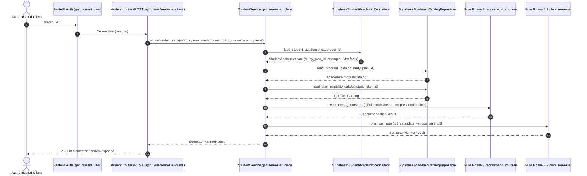

# Phase 8.3 — Semester Planner Service & Authenticated API Validation

**Phase:** 8.3 — Semester Planner Service + Authenticated API  
**Status:** `VALIDATED`  
**Date:** 2026-09-17  
**Policy Version:** `1.0`  
**Planning Scope:** `ACADEMIC_STRUCTURE_ONLY`  

---

## 1. Executive Summary

Phase 8.3 integrates the validated pure deterministic Semester Planner Engine (Phase 8.2) into the authenticated Morshidi backend.

The endpoint `POST /api/v1/me/semester-plans` allows authenticated students to obtain optimal, degree-coherent semester course combinations for their next registration period based strictly on their verified study plan, completed course history, and planning constraints.

### Core Guarantees:
- **Zero Academic Logic in API/Service:** The API route and `StudentService` act strictly as an orchestration layer. All combinatorial search, constraint checking, prerequisite unlock simulations, progress modeling, and ranking are executed by `app.planner.engine.plan_semester`.
- **Zero Database Persistence:** Hypothetical course combinations and synthetic attempts remain purely transient in memory. No database migrations, schema edits, or RLS modifications are required or made.
- **Candidate Window Protection:** `candidate_window_size` is engine configuration ($M=15$) and is strictly non-client-controlled. Extra request fields are forbidden (`extra="forbid"`).
- **Full Candidate Universe Reuse:** `StudentService` computes the complete Phase 7 `RecommendationResult` without presentation limits before the planner applies its search window.
- **Safe Repository Reuse:** Exactly 3 bounded reads per planner request (`load_student_academic_state`, `load_progress_catalog`, `load_plan_eligibility_catalog`). Zero N+1 query loops.

---

## 2. Architecture & Service Orchestration

### 2.1 Target Request Flow


### 2.2 StudentService Method Signature
```python
async def get_semester_plans(
    self,
    owner: str,
    *,
    max_credit_hours: Decimal,
    max_courses: int | None = None,
    max_options: int = 5,
    candidate_window_size: int = DEFAULT_CANDIDATE_WINDOW_SIZE,
) -> SemesterPlannerResult:
```

---

## 3. Schemas & Contracts

### 3.1 Request Schema (`SemesterPlanRequest`)
Located in `app/api/schemas/semester_planner.py`:
```python
class SemesterPlanRequest(BaseModel):
    model_config = ConfigDict(extra="forbid")

    max_credit_hours: Annotated[
        Decimal,
        Field(
            ge=Decimal("0.00"),
            le=Decimal("30.00"),
            description="Maximum credit hours preference for the planned semester (0.00 to 30.00).",
        ),
    ]
    max_courses: Annotated[
        int | None,
        Field(
            default=None,
            ge=1,
            le=10,
            description="Optional maximum number of courses to plan (1 to 10).",
        ),
    ] = None
    max_options: Annotated[
        int,
        Field(
            default=5,
            ge=1,
            le=10,
            description="Maximum number of ranked plan options to return (1 to 10).",
        ),
    ] = 5
```

- **Validation Rules:**
  - `max_credit_hours`: Must be $\ge 0.00$ and $\le 30.00$. `0.00` is explicitly permitted for zero-credit required study plan planning.
  - `max_courses`: Optional integer in $[1, 10]$ or `None`.
  - `max_options`: Integer in $[1, 10]$ with default 5.
  - `extra="forbid"`: Prevents injection of `candidate_window_size`, `owner_user_id`, `study_plan_id`, `attempts`, etc.

### 3.2 Response Schema (`SemesterPlannerResponse`)
```python
class SemesterPlannerResponse(BaseModel):
    study_plan_id: UUID
    semester_planner_policy_version: str
    planning_scope: str  # "ACADEMIC_STRUCTURE_ONLY"
    constraints: PlannerConstraintsResponse
    candidate_window_size: int
    eligible_ranked_candidate_count: int
    evaluated_candidate_count: int
    valid_combination_count: int
    plan_options: list[SemesterPlanOptionResponse]
    review_required_courses: list[str]
    excluded_in_progress: list[str]
    methodology_note: str
    limitations: list[str]
```

---

## 4. Error Mappings

| Condition | Status Code | Error Code / Payload |
|---|:---:|---|
| Missing or invalid Authorization header | `401` | `{"detail": "Not authenticated"}` |
| Student profile not created for user | `404` | `STUDENT_RESOURCE_NOT_FOUND` |
| Invalid request constraint ($<0$ or $>30$ credits, out-of-range counts, extra fields) | `422` | FastAPI validation error / `STUDENT_PROFILE_INVALID` |
| Catalog or planner structural integrity mismatch | `500` | `CATALOG_INTEGRITY_ERROR` |
| Upstream HTTP transport failure or unconfigured service | `503` | `CATALOG_TRANSPORT_ERROR` / `STUDENT_SERVICE_UNAVAILABLE` |
| Valid request, even if 0 options possible or student completed plan | `200` | Valid JSON response with empty `plan_options: []` |

---

## 5. Test Matrix & Verification Results

### 5.1 Test Suites Executed
1. **Service Unit Tests (`test_semester_planner_service.py`):** 11 tests covering single state load, study plan catalog propagation, full Phase 7 candidate universe reuse, stored attempts propagation, exact constraint values, zero writes, error propagation.
2. **API Endpoint Tests (`test_semester_planner_api.py`):** 35 tests covering 401 auth rejection, input parameter boundaries (0, 15, 30 credits; 1..10 courses/options), extra field rejection, Decimal serialization, reason codes, priority tuples, empty plan results, and error mappings.
3. **Pure Engine Test Suite (`test_semester_planner_engine.py`):** 97 tests covering combinatorial search, zero-credit rules, same-semester prerequisite prevention, reason codes, tiebreaking, determinism.
4. **Full Regression Suite:** 456 passed, 10 skipped across all Phase 1–8 test files.

### 5.2 Test Summary Table
| Suite | File | Tests | Result |
|---|---|:---:|:---:|
| Planner Service Orchestration | `apps/api/tests/test_semester_planner_service.py` | 11 | **PASSED** |
| Planner API Endpoint & Validation | `apps/api/tests/test_semester_planner_api.py` | 35 | **PASSED** |
| Pure Semester Planner Engine | `apps/api/tests/test_semester_planner_engine.py` | 97 | **PASSED** |
| Full Repository Suite | `pytest` | 456 passed (10 skipped) | **PASSED** |
| Local Supabase Planner Integration | `apps/api/tests/test_semester_planner_local_supabase.py` | 1 (10 scenarios) | **PASSED** (not skipped) |
| All Local Supabase Integration Suites | `pytest -k local_supabase` | 10 passed (0 skipped) | **PASSED** |

---

## 6. Real Plan 12 Behavioral Facts

- **Same-Semester Prerequisite Chain:** When `0300153` is completed, `1501110` is baseline `ELIGIBLE` and `1501112` is baseline `NOT_ELIGIBLE`. Both courses never appear together in the same semester option. In plans containing `1501110`, `1501112` is reported in `newly_eligible_course_codes`.
- **Zero-Credit Courses:** Courses `0200115` and `1509999` are valid with `max_credit_hours = Decimal("0")`. They contribute to `mandatory_course_count` ($P_1$) and consume `max_courses` without consuming credit budget.
- **Review-Required Exclusion:** Courses `1505311` and `1505320` with unresolved prerequisite logic are strictly excluded from plan options and reported in `review_required_courses`.
- **Referenced-Only Courses:** Course `0300103` is never a plan course, earns no degree credits, and only impacts downstream eligibility when completed.
- **In-Progress Courses:** Courses marked `IN_PROGRESS` are excluded from plan options, do not consume the upcoming semester's credit budget, and are reported in `excluded_in_progress`.

---

## 7. Security & Data API Request Invariants

### 7.1 Server-Side Authentication Verification
- Authentication is strictly handled via `get_current_user` in `app/core/auth.py`.
- The Bearer token is verified directly with Supabase Auth via server-side HTTP `GET /auth/v1/user`.
- **Zero Trust in Local Decoding:** Claims are never decoded locally or unverified. The authenticated user UUID is obtained exclusively from the server-validated response `body["id"]`.
- No client-supplied `owner_user_id` or `study_plan_id` is permitted.

### 7.2 High-Level Repository vs Actual Data API HTTP Requests
`StudentService.get_semester_plans` makes exactly **3 high-level repository method calls**:
1. `load_student_academic_state(owner)`:
   - 1 HTTP GET to `student_academic_profiles`
   - 1 HTTP GET to `student_course_attempts`
   - Subtotal: **2 HTTP requests**
2. `load_progress_catalog(study_plan_id)`:
   - 1 HTTP GET to `study_plans`
   - 1 HTTP GET to `requirement_groups`
   - 1 HTTP GET to `study_plan_courses`
   - Subtotal: **3 HTTP requests**
3. `load_plan_eligibility_catalog(study_plan_id)`:
   - 1 HTTP GET to `study_plans` (study plan & university metadata)
   - 1 HTTP GET to `study_plan_courses` (plan courses & course identities)
   - 1 HTTP GET to `course_dependency_groups` (chunked in batches of 50; 68 courses = 2 chunks for Plan 12)
   - 1 HTTP GET to `course_dependency_options` (chunked in batches of 50; 32 groups = 1 chunk for Plan 12)
   - Subtotal: **5 HTTP requests** (or 4 for smaller plans)

**Total Data API HTTP Requests:** Exactly **10 HTTP requests** across the entire operation for Zarqa University Plan 12.

**Critical Invariant:**
- The HTTP request count is fixed and bounded for the current study plan catalog ($10$ requests for Plan 12).
- **Zero HTTP requests** occur inside the recommendation ranking loop, planner combination generation, whole-plan simulation, or prerequisite unlock simulation.
- Across different study plans, chunked dependency requests batch by 50 rows per request, scaling solely with total plan courses and dependency groups, never with student attempts, candidate count, or combinatorial branch-and-bound exploration.

### 7.3 Zero Persistence Guarantee
Hypothetical course combinations and synthetic passed attempts remain in transient memory. No database writes (`INSERT`, `UPDATE`, `DELETE`) or cache records are written.


